# 🚀 EasyLearning - Online and Offline Course Selling Website (ASP.NET Core MVC)

## 📌 Giới thiệu

EasyLearning là một nền tảng học trực tuyến cho phép người dùng mua, đăng ký và tham gia các khóa học online và offline. Dự án được phát triển bằng **ASP.NET Core MVC** và **SQL Server**. Người học có thể lựa chọn giữa các khóa học trực tuyến hoặc tham gia các khóa học offline để nâng cao kỹ năng của mình.

## ✨ Tính năng chính

- 📚 Quản lý khóa học (thêm, sửa, xóa, tìm kiếm khóa học)
- 🎥 Hệ thống video bài giảng và bài kiểm tra
- 🔐 Xác thực và phân quyền người dùng
- 💳 Thanh toán trực tuyến qua MoMo
- ☁️ Lưu trữ phương tiện trên Azure blob storage
- 💬 Bình luận vfa ghi chú bài học
- 🛒 Quản lý giỏ hàng và lịch sử giao dịch
- 👤 Quản lý tài khoản cá nhân và chứng chỉ

## 🛠 Công nghệ sử dụng

- **Backend:** ASP.NET Core MVC
- **CSDL:** SQL Server
- **Xác thực:** Identity
- **Giao diện:** Razor Pages, Bootstrap, jQuery
- **Lưu trữ:** Azure blob storage
- **Thanh toán:** MoMo
- **Quản lý dự án:** Git, GitHub

## 🚀 Cài đặt và chạy dự án

### 1️⃣ Clone repository

```bash
git clone https://github.com/trantrung28122003/EasyLearning-CSharp.git
cd EasyLearning-CSharp
```

### 2️⃣ Phục hồi các gói NuGet

```bash
dotnet restore
```

### 3️⃣ Cài đặt SQL Server

- Tạo database `EasyLearningDB`
- Chỉnh sửa file `appsettings.json`:

```json
"ConnectionStrings": {
  "DefaultConnection": "Server=localhost;Database=EasyLearningDB;User Id=sa;Password=yourpassword;"
}
```

- Chạy lệnh di cư trong Package Manager Console:

```bash
Update-Database
```

### 3️⃣ Chạy project

- Sử dụng Visual Studio hoặc chạy lệnh:

```bash
dotnet run
```

## 🎨 Hình ảnh giao diện

### 🔑 Xác thực & Tài khoản

- **🔒 Trang đăng nhập**  
  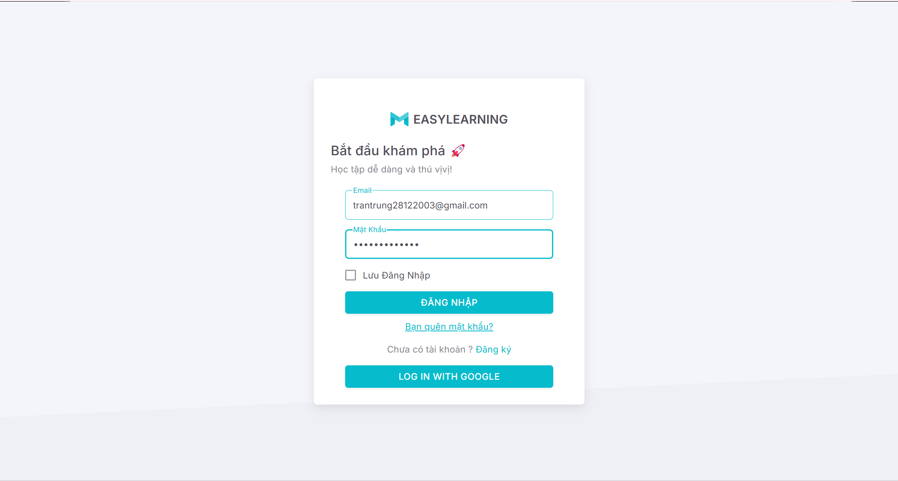
- **🔢 Trang đăng ký**  
  
- **👤 Hồ sơ cá nhân**  
  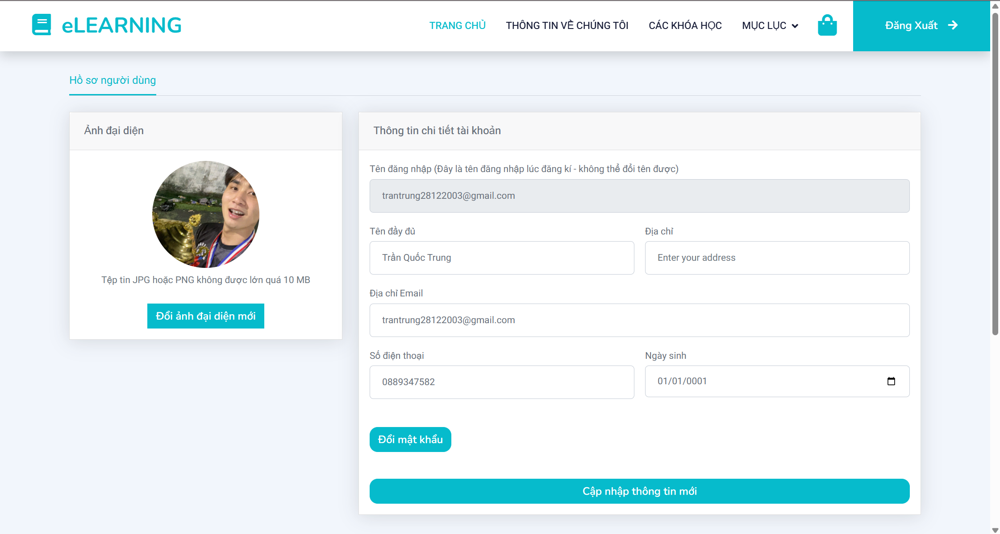

### 🎓 Khóa học & Nội dung học tập

- **📚 Trang chi tiết khóa học**  
  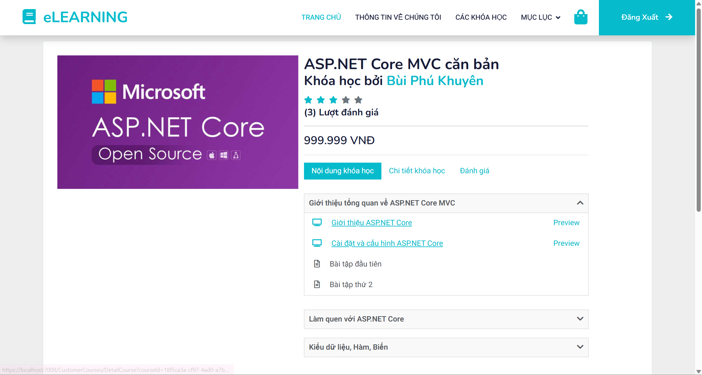
- **📚 Danh sách khóa học**  
  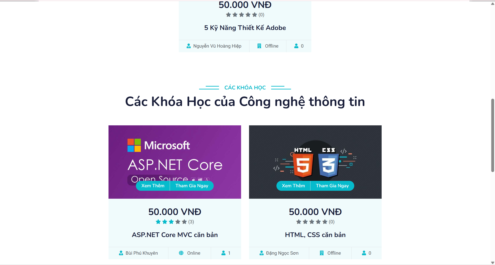
- **🎥 Học video**  
  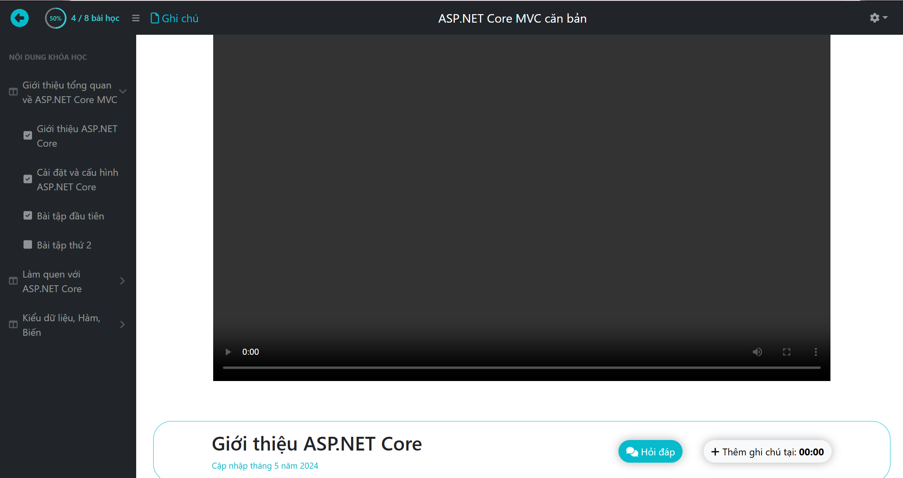
- **📝 Bài tập trắc nghiệm**  
  
- **👒 Ghi chú bài học**
  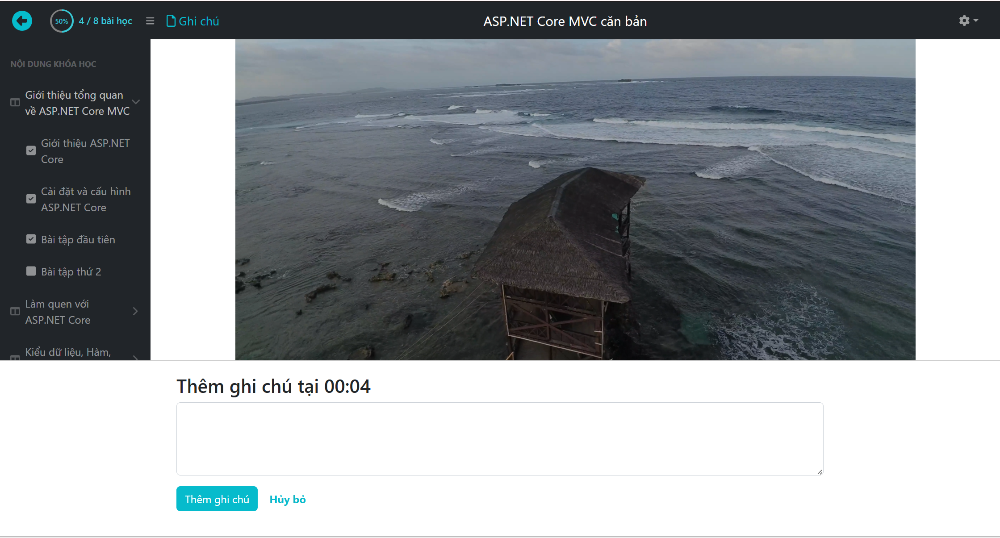
- **👒 Danh sách ghi chú bài học**
  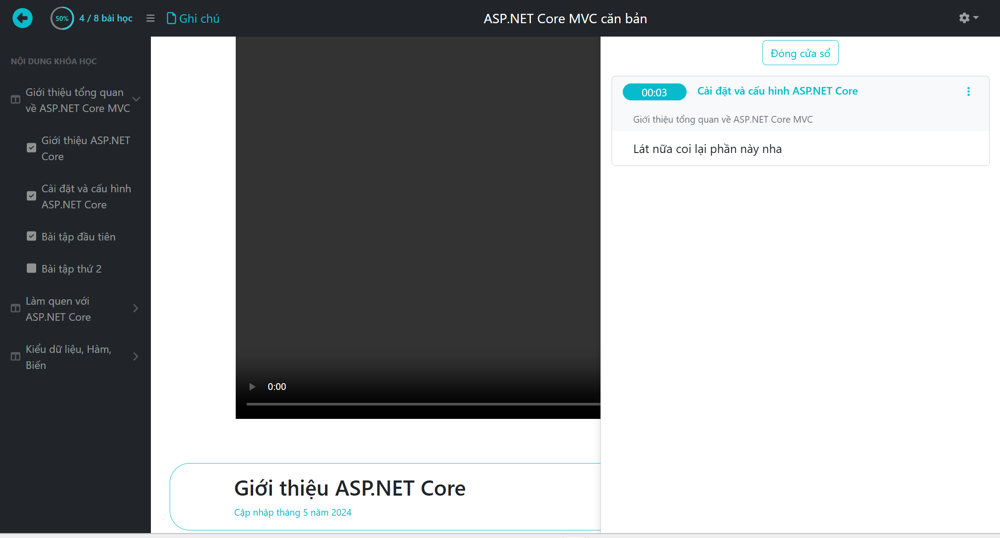
- **📅 Thời khóa biểu**  
  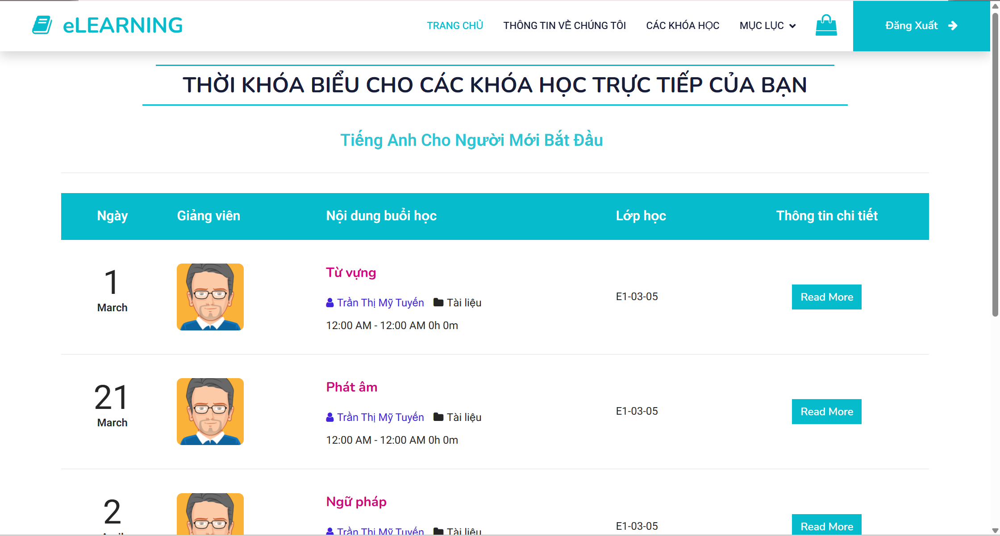

### 💳 Thanh toán & Mua hàng

- **🛒 Giỏ hàng**  
  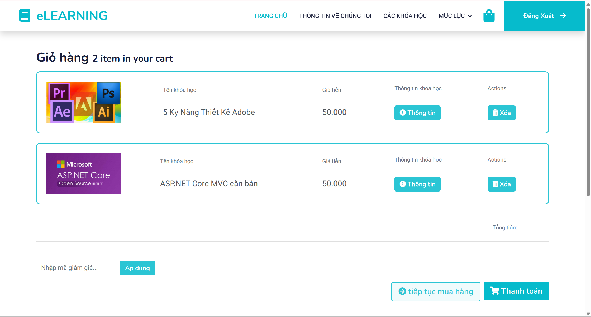

### 🛠 Quản trị

- **📃 Danh sách khóa học**  
  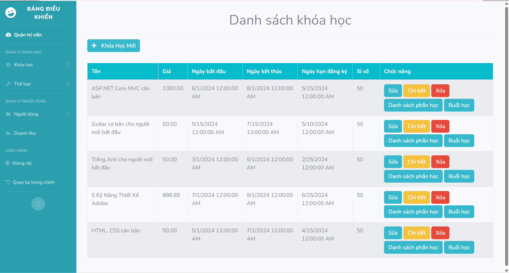
- **👥 Quản lý người dùng**
  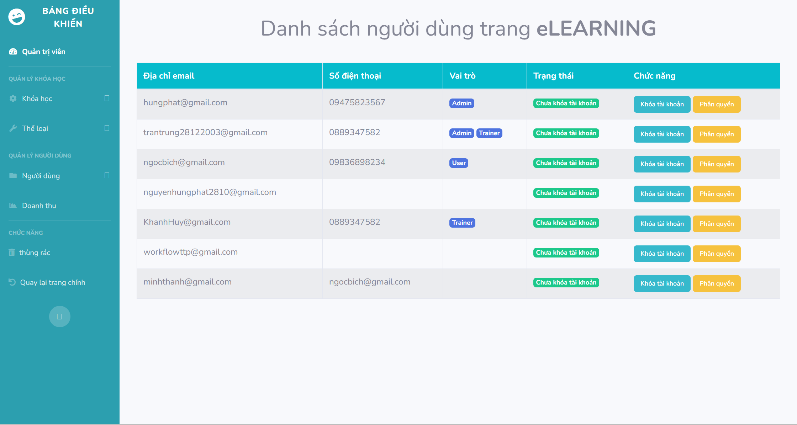
- **🗑️ Thùng rác**
  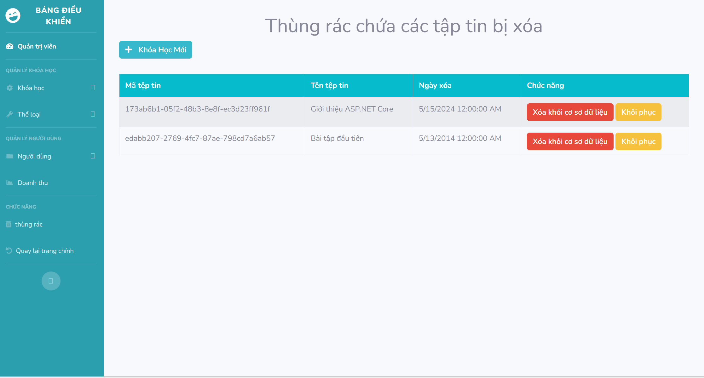

## 🤝 Đóng góp

Mọi đóng góp đều được hoan nghênh! Hãy tạo pull request hoặc liên hệ qua email: `easylearning@gmail.com` 💎.
